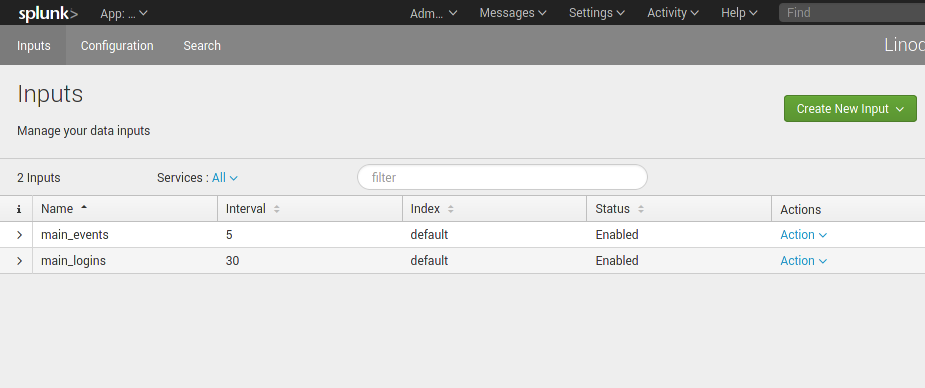
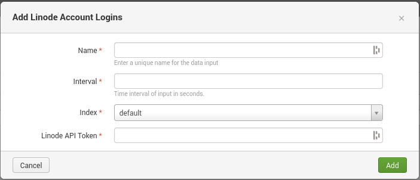
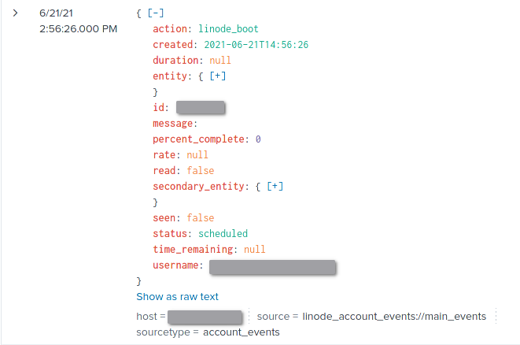

# splunk-app-linode

This is a proof of concept Splunk app for collecting Linode events and metrics. This app was developed using [Splunk Add-on Builder](https://splunkbase.splunk.com/app/2962/).

## Usage

To install the app into a Splunk instance, follow the steps outlined in the [installation section](#installation).

Inputs are configured through a UI within splunk that allows for the creation, configuration, and deletion of [modular data input sources](#currently-supported-inputs). Each input can be configured with a custom Linode API Token and poll interval.

After an input is created, it will automatically begin polling Linode's API on the user-specified interval. Any new events can then be queried through Splunk.

## Currently Supported Inputs

### Account Events

- Collect events in real-time from `/account/events`

### Account Logins

- Collect events in real-time from `/account/logins`

### Account Notifications

- Collect events in real-time from `/account/notifications`

### Account Invoices

- Collect events in real-time from `/account/invoices`

## Installation

WIP

## Next Steps

* What other endpoints/features should we support?
    * Store the state of incomplete account events in order to create new logs for event updates
    * GET requests on entities referenced in the `/account/events` logs
        * Would cause significantly more API requests (maybe it should be opt-in?)
    * GET `/account/service-transfers`
    * GET `/account/entity-transfers`
        

* Should we use [Splunk Add-on Builder](https://splunkbase.splunk.com/app/2962/)?
    * Pros
        * Eases development of new inputs
        * Mitigates the need for human-maintained boilerplate code
        * Offers some form of automated testing/validation (needs more research)
        * Is fairly standard across Splunk apps (See [Microsoft Azure Add-on for Splunk](https://splunkbase.splunk.com/app/4882/))
    * Cons
        * Complicates development workflow
        * Adds a lot of generated boilerplate code bloat